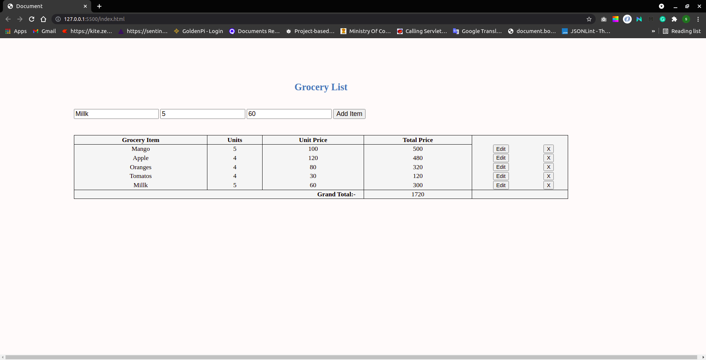
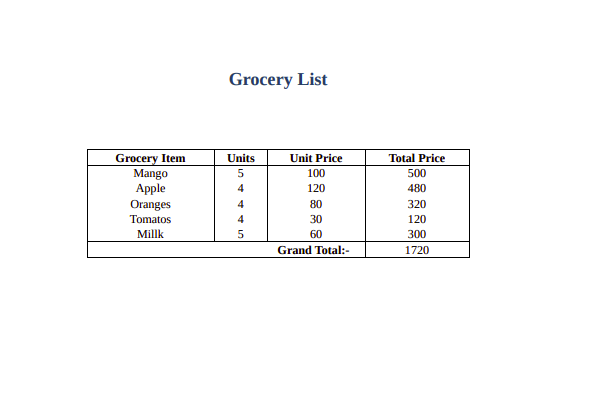

# Grocery-List-Using-JS-DOM

## Description
 This project is implement to practice the Document Object Model (DOM). This is a single page web application whihc provide a simple but usefull UI to the user to prepare the Grocery list. User can add, delete & update any item in the list. The data of the list is store locally using **localStorage** DOM object.

 ## Print view of the application
 

 ## Application Link
 [Grocery List](https://jainshivsagar.github.io/Grocery-List-Using-JS-DOM/)